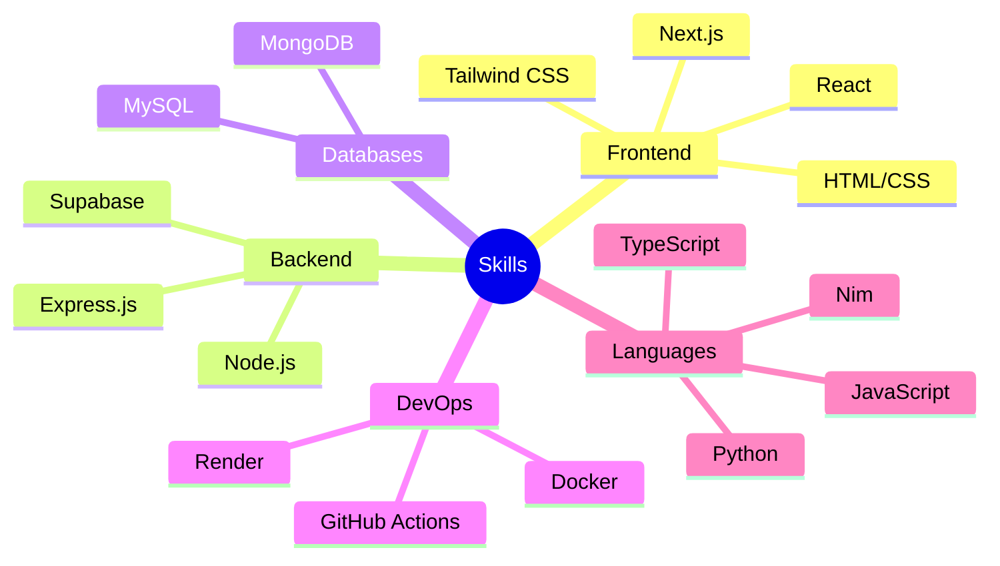

<div align="center">
  
  
  [](https://www.linkedin.com/in/mohamed-ali-hamroun-486573314/)
  [](mailto:hamroun1969@gmail.com)
  [](https://mohamedalihamroun.me)
</div>


## 👨‍💻 About Me

> "Engineering elegant solutions to complex technical challenges"


<div align="left">
  <p>
    I'm Mohamed Ali Hamroun, a results-driven Full Stack Developer and Computer Science student from Tunisia with a passion for building scalable, high-performance applications from the ground up. With expertise spanning both software and hardware domains, I specialize in developing innovative solutions that combine technical excellence with intuitive user experiences.
  </p>
  
  <p>
    My technical curiosity drives me to understand systems at their core—whether it's engineering a custom database engine in Go, architecting efficient web servers in Nim, or developing hardware solutions with microcontrollers. I thrive in the full development lifecycle, from conceptualizing architecture to optimizing performance and deployment.
  </p>

  
  
  <p>🔭 Currently architecting my portfolio platform at <b>mohamedalihamroun.me</b></p>
  <p>🌱 Focused on distributed systems and microservice architecture</p>
  <p>🚀 Committed to writing clean, maintainable, and efficient code</p>
  <p>🔍 Experienced in both system-level and application development</p>
</div>

<details>
<summary>📊 GitHub Stats</summary>
<div align="center">
  
  
  
  <br>
  
  <!-- GitHub Streak Stats -->
  
  
  <br>
  
  <!-- GitHub Activity Graph -->
  
  
  <br>
  
  <!-- GitHub Contributions -->
  
</div>
</details>

## 💼 Featured Projects

<div align="center">

| Project | Description | Technologies |
|---------|-------------|-------------|
| 🌐 **Mega-Tel Web App** | MERN stack application with secure authentication and comprehensive database management |   |
| ⚙️ **Online Compiler** | Interactive cloud-based compiler supporting multiple programming languages (in development) |   |
| 🏨 **Reservation System** | Hotel room and coffee table booking platform with intuitive drag-and-drop UI |   |
| 📝 **Note-Taking App** | Dynamic note organization tool built with React and framer-motion |   |

</div>

## 🛠️ Technical Skills

<div align="center">
  
</div>

<details>
<summary>💻 More Skills</summary>
<br>



</details>

## 📫 Connect With Me

<div align="center">
  <a href="https://github.com/mohamedx2"></a>
  <a href="https://www.linkedin.com/in/mohamed-ali-hamroun-486573314/"></a>
  <a href="mailto:hamroun1969@gmail.com"></a>
  <a href="tel:+21652269898"></a>
  <a href="https://twitter.com/your-twitter"></a>
  <a href="https://dev.to/your-dev-to"></a>
</div>

## 🌱 Current Focus

<table>
  <tr>
    <td width="50%">
      <h3 align="center">What I'm Building</h3>
      <p align="center">
        <a href="https://go.dev/">
          
        </a>
        <a href="https://nim-lang.org/">
          
        </a>
      </p>
      <p align="center">Currently working on low-level systems programming and custom frameworks</p>
    </td>
    <td width="50%">
      <h3 align="center">Hardware Projects</h3>
      <p align="center">
        <a href="#">🤖 Line Follower Robot with Arduino & TCRT5000</a>
      </p>
    </td>
  </tr>
</table>

## 💼 Work Experience

<div align="center">
  <h3>🧑‍💻 Full Stack Developer — Personal & Academic Projects</h3>
  <p><em>2022 — Present</em></p>
</div>

<table>
  <tr>
    <td>
      
      <h4>Mega-Tel Reservation System</h4>
      <p>Developed a full-stack hotel & café reservation system using the MERN stack with authentication via NextAuth and Supabase, deployed with Docker.</p>
    </td>
  </tr>
  <tr>
    <td>
      
      <h4>Drag-and-Drop Note System</h4>
      <p>Created a drag-and-drop note-taking system with React, Framer Motion, and Supabase SQL for real-time updates and persistent storage.</p>
    </td>
  </tr>
  <tr>
    <td>
      
      <h4>Online Compiler Platform</h4>
      <p>Built an online compiler web app that executes code in multiple languages through a custom backend.</p>
    </td>
  </tr>
  <tr>
    <td>
      
      <h4>Custom Database Engine</h4>
      <p>Engineered a Go-based DBMS using an LSM Tree for indexing and custom disk storage architecture.</p>
    </td>
  </tr>
  <tr>
    <td>
      
      <h4>Async Web Server</h4>
      <p>Built an async web server in Nim with dynamic route handling and HTML responses.</p>
    </td>
  </tr>
  <tr>
    <td>
      
      <h4>Line-Following Robot</h4>
      <p>Programmed a line-following robot using Arduino Uno and TCRT5000 sensors with L298N motor control logic.</p>
    </td>
  </tr>
</table>

## 📊 Weekly Development Breakdown

<!--START_SECTION:waka-->
```text
JavaScript   10 hrs 41 mins  ████████████▓░░░░░░░░  42.01%
TypeScript   8 hrs 12 mins   ████████▒░░░░░░░░░░░░  32.33%
React        4 hrs 32 mins   ████▒░░░░░░░░░░░░░░░░  17.85%
CSS          1 hr 12 mins    █▒░░░░░░░░░░░░░░░░░░░   4.72%
JSON         42 mins         ▒░░░░░░░░░░░░░░░░░░░░   2.77%
```
<!--END_SECTION:waka-->

## 🧠 My Tech Stack Explained

<details>
<summary><b>Frontend Development</b></summary>
<br>
<p align="center">
  I specialize in creating responsive and interactive user interfaces using React and Next.js, enhanced with Tailwind CSS for rapid styling. My focus is on performance optimization, accessibility compliance, and creating delightful user experiences.
</p>
<p align="center">
  
</p>
</details>

<details>
<summary><b>Backend Development</b></summary>
<br>
<p align="center">
  My backend solutions focus on security, scalability and performance using Node.js/Express.js. I implement RESTful APIs following best practices and utilize MongoDB and MySQL for efficient data management.
</p>
<p align="center">
  
</p>
</details>

## 📦 Open Source Projects

<div align="center">
  <table>
    <tr>
      <td>
        <h3>🔹 GoDB – Lightweight Go Database Engine</h3>
        <p>GoDB is a minimalist, high-performance database system written in Go. It features ACID-like transactions, data validation, thread-safe operations, and cross-platform support. GoDB includes a CLI, a Node.js client library, and a REST API, making it versatile for various applications.</p>
        <p align="center">
          <a href="https://mohamedalihamroun.me"></a>
          <a href="https://github.com/mohamedx2/godb"></a>
        </p>
        <p align="center">
          
          
          
        </p>
      </td>
    </tr>
    <tr>
      <td>
        <h3>🔹 Hamroun Express – Express-Inspired Web Framework</h3>
        <p>Hamroun Express is a lightweight web framework for Node.js that emulates the simplicity and flexibility of Express.js. It supports middleware, basic routing, JSON response helpers, and is written in TypeScript, making it a great choice for developers seeking a straightforward and efficient server framework.</p>
        <p align="center">
          <a href="https://github.com/mohamedx2/hamroun-express"></a>
        </p>
        <p align="center">
          
          
          
        </p>
      </td>
    </tr>
  </table>
</div>

## 🎯 Future Goals

- Contribute to open-source projects
- Master cloud architecture and serverless technologies
- Launch a developer education platform
- Speak at tech conferences

---

<div align="center">
  
  <br><br>
  <a href="https://www.buymeacoffee.com/mohamedx2"></a>
  <br><br>
  
</div>

<details>
<summary>⚡ Fun Fact</summary>
<br>
<div align="center">
  
  <p>I'm a proud member of the Java Haters Club! 😅</p>
</div>
</details>
