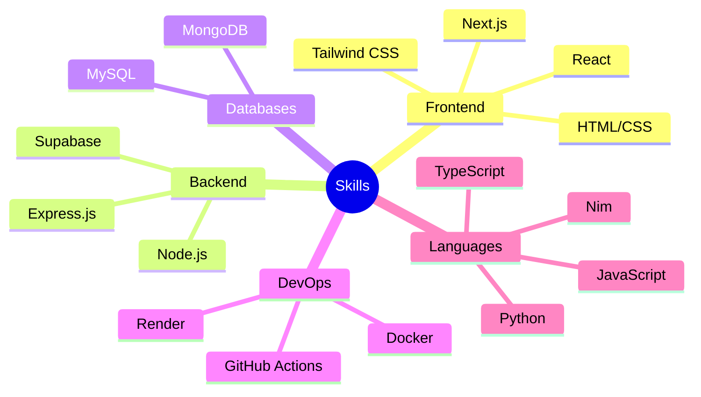
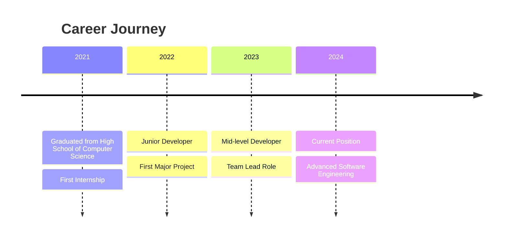

<div align="center">
  
  
  [](https://www.linkedin.com/in/mohamed-ali-hamroun-486573314/)
  [](mailto:hamroun1969@gmail.com)
  [](https://mohamedalihamroun.me)
</div>


## 👨‍💻 About Me

> "Building elegant solutions to complex problems"

I'm a passionate full-stack developer with a strong foundation in computer science, having graduated from the High School of Computer Science in Mahdia. I specialize in creating efficient, scalable web applications using modern technologies.

- 🔭 Currently developing my portfolio site at **mohamedalihamroun.me**
- 🌱 Always learning and expanding my tech stack
- 💬 Let's talk about web development, cloud solutions, or software architecture

<details>
<summary>📊 GitHub Stats</summary>
<div align="center">
  
  
  
  <br>
  
  <!-- GitHub Streak Stats -->
  
  
  <br>
  
  <!-- GitHub Activity Graph -->
  
  
  <br>
  
  <!-- GitHub Contributions -->
  
</div>
</details>

## 💼 Featured Projects

<div align="center">

| Project | Description | Technologies |
|---------|-------------|-------------|
| 🌐 **Mega-Tel Web App** | MERN stack application with secure authentication and comprehensive database management |   |
| ⚙️ **Online Compiler** | Interactive cloud-based compiler supporting multiple programming languages (in development) |   |
| 🏨 **Reservation System** | Hotel room and coffee table booking platform with intuitive drag-and-drop UI |   |
| 📝 **Note-Taking App** | Dynamic note organization tool built with React and framer-motion |   |

</div>

## 🛠️ Technical Skills

<div align="center">
  
</div>

<details>
<summary>💻 More Skills</summary>
<br>



</details>

## 📫 Connect With Me

<div align="center">
  <a href="https://github.com/mohamedx2"></a>
  <a href="https://www.linkedin.com/in/mohamed-ali-hamroun-486573314/"></a>
  <a href="mailto:hamroun1969@gmail.com"></a>
  <a href="tel:+21652269898"></a>
  <a href="https://twitter.com/your-twitter"></a>
  <a href="https://dev.to/your-dev-to"></a>
</div>

## 🌱 Current Focus

<table>
  <tr>
    <td width="50%">
      <h3 align="center">What I'm Learning</h3>
      <p align="center">
        <a href="https://go.dev/">
          
        </a>
        <a href="https://aws.amazon.com/">
          
        </a>
        <a href="https://www.rust-lang.org/">
          
        </a>
      </p>
      <p align="center">Currently expanding my skillset with cloud architecture and systems programming</p>
    </td>
    <td width="50%">
      <h3 align="center">Latest Articles</h3>
      <p align="center">
        <a href="#">📝 Building Scalable Microservices with Docker</a><br/>
        <a href="#">📝 React Performance Optimization Techniques</a><br/>
        <a href="#">📝 Introduction to Web3 Development</a>
      </p>
    </td>
  </tr>
</table>

## 🏆 Achievements & Certifications

<div align="center">
  <a href="#"></a>
  <a href="#"></a>
  <a href="#"></a>
</div>

## 💼 Work Experience



## 📊 Weekly Development Breakdown

<!--START_SECTION:waka-->
```text
JavaScript   10 hrs 41 mins  ████████████▓░░░░░░░░  42.01%
TypeScript   8 hrs 12 mins   ████████▒░░░░░░░░░░░░  32.33%
React        4 hrs 32 mins   ████▒░░░░░░░░░░░░░░░░  17.85%
CSS          1 hr 12 mins    █▒░░░░░░░░░░░░░░░░░░░   4.72%
JSON         42 mins         ▒░░░░░░░░░░░░░░░░░░░░   2.77%
```
<!--END_SECTION:waka-->

## 🧠 My Tech Stack Explained

<details>
<summary><b>Frontend Development</b></summary>
<br>
<p align="center">
  I specialize in creating responsive and interactive user interfaces using React and Next.js, enhanced with Tailwind CSS for rapid styling. My focus is on performance optimization, accessibility compliance, and creating delightful user experiences.
</p>
<p align="center">
  
</p>
</details>

<details>
<summary><b>Backend Development</b></summary>
<br>
<p align="center">
  My backend solutions focus on security, scalability and performance using Node.js/Express.js. I implement RESTful APIs following best practices and utilize MongoDB and MySQL for efficient data management.
</p>
<p align="center">
  
</p>
</details>

## 🎯 Future Goals

- Contribute to open-source projects
- Master cloud architecture and serverless technologies
- Launch a developer education platform
- Speak at tech conferences

---

<div align="center">
  
  <br><br>
  <a href="https://www.buymeacoffee.com/mohamedx2"></a>
  <br><br>
  
</div>

<details>
<summary>⚡ Fun Fact</summary>
<br>
<div align="center">
  
  <p>I'm a proud member of the Java Haters Club! 😅</p>
</div>
</details>
