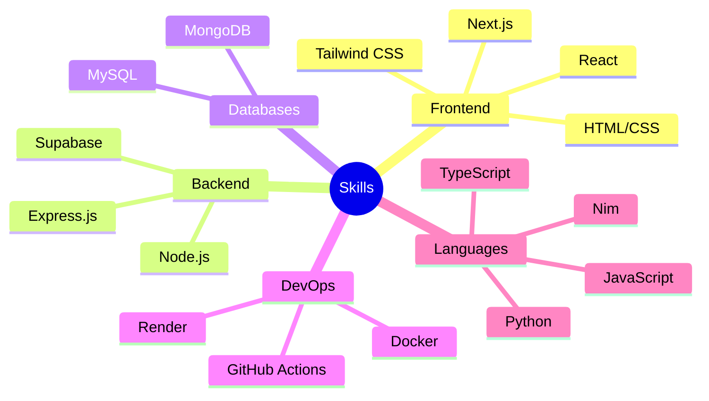

  
  
  
  
  

## 👨‍💻 About Me

> "Building elegant solutions to complex problems"

I'm a passionate full-stack developer with a strong foundation in computer science, having graduated from the High School of Computer Science in Mahdia. I specialize in creating efficient, scalable web applications using modern technologies.

- 🔭 Currently developing my portfolio site at **mohamedalihamroun.me**
- 🌱 Always learning and expanding my tech stack
- 💬 Let's talk about web development, cloud solutions, or software architecture

📊 GitHub Stats

  
  

## 💼 Featured Projects

| Project | Description | Technologies |
|---------|-------------|-------------|
| 🌐 **Mega-Tel Web App** | MERN stack application with secure authentication and comprehensive database management |   |
| ⚙️ **Online Compiler** | Interactive cloud-based compiler supporting multiple programming languages (in development) |   |
| 🏨 **Reservation System** | Hotel room and coffee table booking platform with intuitive drag-and-drop UI |   |
| 📝 **Note-Taking App** | Dynamic note organization tool built with React and framer-motion |   |

## 🛠️ Technical Skills

  

💻 More Skills

 

## 📫 Connect With Me

  

---

  
    
  

⚡ Fun Fact

 

  
  
I'm a proud member of the Java Haters Club! 😅

